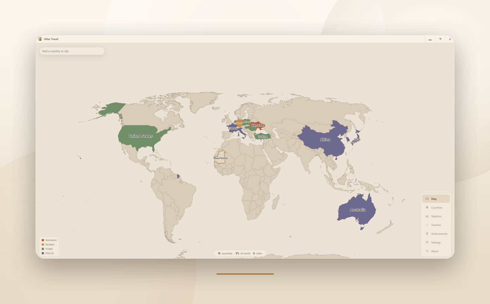
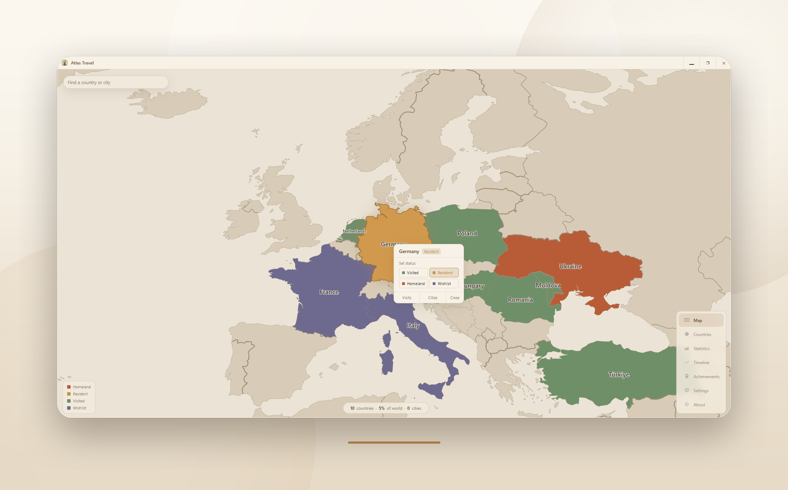
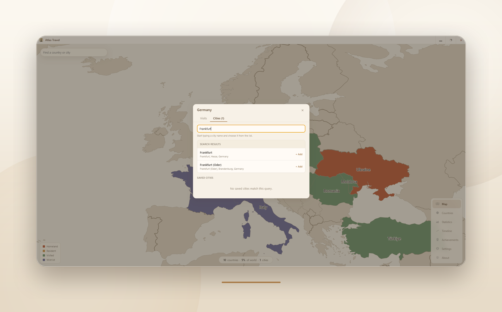
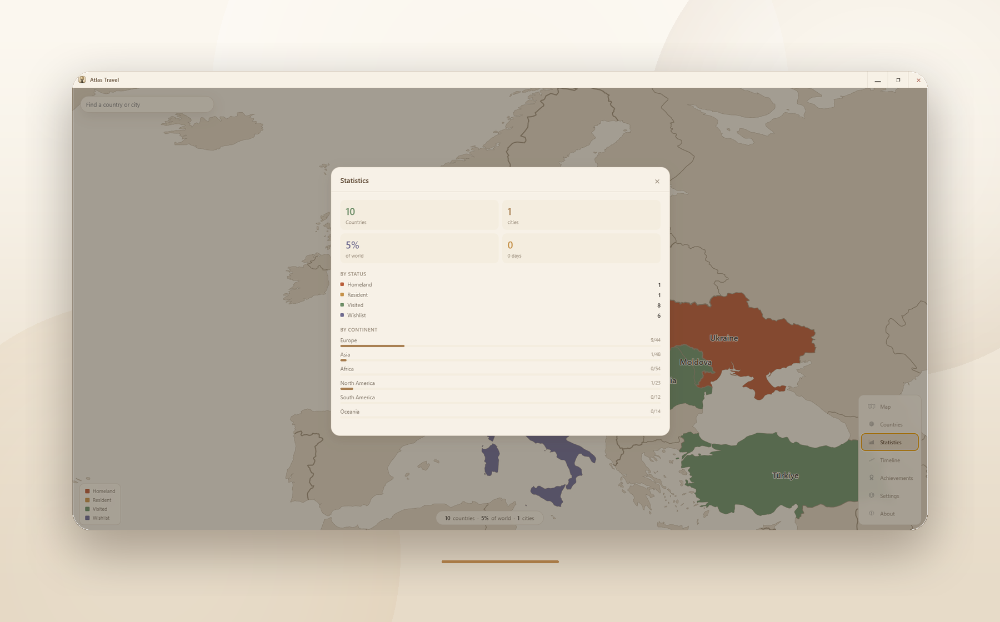
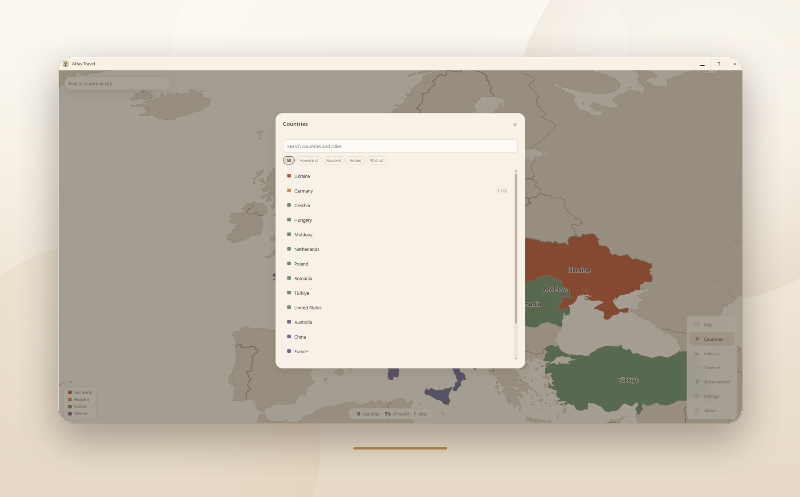
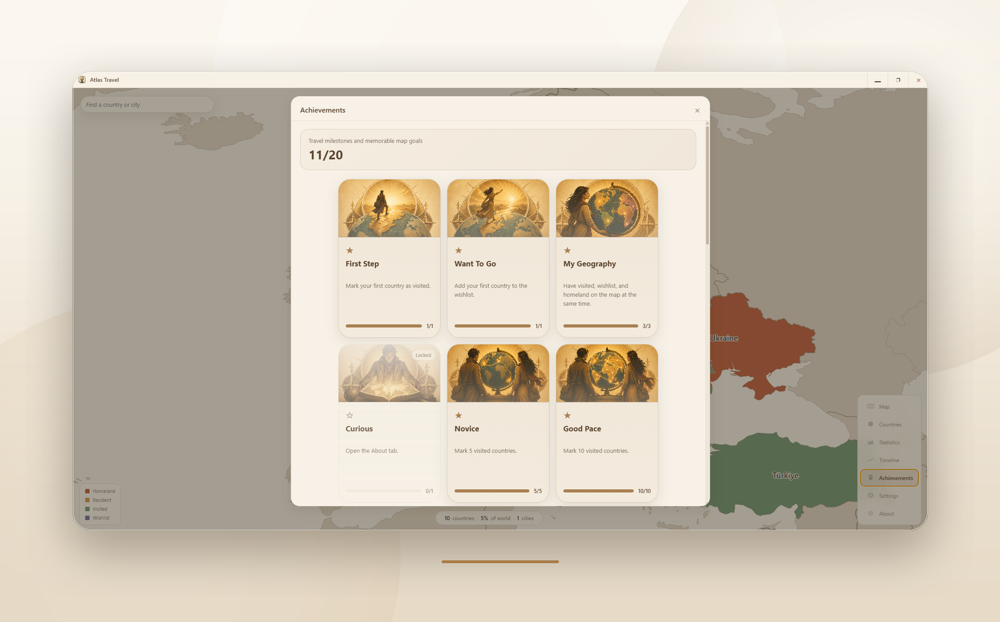

<p align="center">
  
</p>

# Atlas Travel

<p align="center">
  <a href="README.md">English</a> |
  <a href="README.de.md">Deutsch</a> |
  <a href="README.ru.md">Русский</a>
</p>


Atlas Travel ist eine Desktop-App zum Erfassen besuchter Länder, Städte, Reisen, Notizen, Fotos und Reiseziele. Die Daten bleiben lokal, die Karte ist bewusst klar und grenzbasiert gestaltet, und es werden weder ein Konto noch Cloud-Synchronisierung benötigt.

Erstellt von Artem Silenko.

## Highlights

- Interaktive D3-Weltkarte mit Zoom, Pan, Labels, Statusfarben und Länder-/Städtesuche.
- Electron-Architektur mit getrennten main-, preload- und renderer-Schichten, verbunden über typisiertes IPC.
- Lokale SQLite-Persistenz für Reisedaten, Besuche, Fotos, Tags, Einstellungen und Achievement-Fortschritt.
- Mehrsprachige UI mit i18next: Englisch, Deutsch, Russisch und Ukrainisch.
- Portfolio-taugliche Funktionen: Statistiken, Timeline, Achievements, Local-first Privacy und PNG-Kartenexport.

## Funktionen

- Länder als homeland, resident, visited oder wishlist markieren.
- Städte mit geografischen Koordinaten auf der Karte hinzufügen.
- Reisen mit Datumsbereichen, Notizen, Fotos und Tags speichern.
- Fortschritt nach Kontinenten, Ländern und Reise-Timeline auswerten.
- Eine PNG-Karte für Teilen, Präsentation oder Portfolio exportieren.
- Zwischen Englisch, Deutsch, Russisch und Ukrainisch wechseln.
- Eine lokale SQLite-Datenbank über den Electron-Main-Prozess verwenden.

## Screenshots

### Interaktive Weltkarte



### Länderdetails



### Stadtsuche



### Statistiken



### Länder und Suche



### Achievements



## Tech Stack

| Ebene | Technologie |
| --- | --- |
| Desktop | Electron, electron-vite |
| UI | React 19, TypeScript |
| Karte | D3, TopoJSON, world-atlas, us-atlas |
| Speicherung | SQLite, better-sqlite3 |
| State | Zustand |
| i18n | i18next, react-i18next |

## Voraussetzungen

- Node.js 22 oder neuer
- npm
- Windows, macOS oder Linux

`better-sqlite3` ist eine native Abhängigkeit. Wenn native Module nach einem Wechsel der Electron-Version nicht mehr passen, führen Sie aus:

```bash
npx electron-builder install-app-deps
```

## Erste Schritte

Den aktuellen Windows Installer gibt es unter [GitHub Releases](https://github.com/anzenxx/Atlas-Travel/releases).

```bash
npm install
npm run dev
```

## Skripte

| Befehl | Zweck |
| --- | --- |
| `npm run dev` | Electron-App im Entwicklungsmodus starten |
| `npm run start` | Gebaute App als Preview starten |
| `npm run typecheck` | TypeScript-Prüfung für main/preload und renderer |
| `npm run lint` | ESLint ausführen |
| `npm run format` | Dateien mit Prettier formatieren |
| `npm run build` | Typecheck und Build ausführen |
| `npm run build:win` | Windows-Paket bauen |
| `npm run build:mac` | macOS-Paket bauen |
| `npm run build:linux` | Linux-Paket bauen |

## Projektstruktur

```text
src/
  main/
    database.ts       SQLite-Schema und Abfragen
    index.ts          Electron-Main-Prozess
    ipc.ts            IPC-Handler
  preload/
    index.ts          Context-Bridge-API
  renderer/src/
    components/       React-Komponenten
    hooks/            Renderer-Hooks
    i18n/             Lokalisierte Texte
    store/            Zustand Store
    types/            Gemeinsame TypeScript-Typen
    utils/            Helfer für Karte, Länder, Städte und Achievements
```

## Datenspeicherung

Atlas Travel speichert App-Daten lokal im Electron-User-Data-Verzeichnis. Die App erstellt keine Konten, lädt keine Reisedaten hoch und synchronisiert standardmäßig nicht mit einem Cloud-Dienst.

Das SQLite-Schema umfasst:

```sql
countries   (id, iso_code, status, created_at)
cities      (id, country_iso, name, lat, lng, created_at)
visits      (id, place_type, place_id, date_from, date_to, notes, created_at)
photos      (id, visit_id, file_path, thumbnail_path, created_at)
tags        (id, name)
visit_tags  (visit_id, tag_id)
settings    (key, value)
```

## Checks

Vor dem Veröffentlichen von Änderungen ausführen:

```bash
npm run typecheck
npm run lint
```

## Hinweise zum Repository

- Build-Ausgaben werden ignoriert: `dist/`, `out/` und `node_modules/`.
- Inkrementelle TypeScript-Dateien werden über `*.tsbuildinfo` ignoriert.
- Binäre Assets wie Icons, Bilder, Sounds und App-Pakete sind in `.gitattributes` als binary markiert.

## Lizenz

Dieses Projekt ist unter der MIT License lizenziert. Siehe [LICENSE.md](LICENSE.md).
